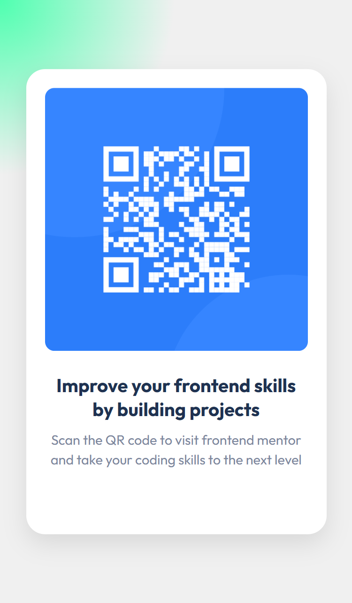

# QR Project
First Frontend Mentor Project

# 👋 Welcome Back to Frontend Development – Promise Sylvester

After spending the past year immersed in AI training, NLP models, and LLM experimentation, my frontend skills took a quiet backseat... and my GitHub? Let’s just say it enjoyed a long nap.

But that changes now.

I’ve recently joined the [Frontend Mentor](https://www.frontendmentor.io/) program to rebuild my frontend muscle—one real-world project at a time. This repo is the first step in my journey back: no fluff, no ego—just clean, modern frontend challenges that sharpen my skills and expand my portfolio.

### Why this matters:
- 🧠 Rewiring my brain from AI prompts to HTML/CSS grids  
- 💪 Rebuilding consistency through challenge-based learning  
- 🧰 Refamiliarizing myself with best practices and UI fundamentals  

Whether you're here to learn, give feedback, or track my progress—welcome! Let’s get better, build things, and ship work that speaks for itself.

# QR Code Component

This is a solution to the [Frontend Mentor QR Code Component Challenge](). The goal was to build a simple and responsive card component that features a QR code, styled layout and accessible HTML structure.

## Table of contents

- [Overview](#overview)
- [Tech Used](#tech-used)
- [Screenshot](#screenshot)
- [Live Preview](#live-preview)
- [Tech Used](#tech-used)
- [What I had to relearn](#what-i-had-to-relearn)
- [Future Improvements](#future-improvements)
- [Continued development](#continued-development)

##  Overview

This is a beginner-level frontend project that helped me:

- Rebuild my confidence in HTML and CSS after a break focused on AI.
- Reinforce the use of semantic tags (I strictly made used of semantic tags only since it is not a large project).
- Practice layout centering using Flexbox
- Create a clean, mobile-friendly component with scalable typography and spacing
- Use responsive design techniques (media queries and rem units)

##  Tech Used

- Semantic HTML5
- CSS Flexbox
- Media Queries for responsiveness
- Google Fonts (Outfit)

## Screenshots

.png)

##  Live Preview

[Live Site]()

##  What I had to relearn

- How to use `display: flex` to center content both vertically and horizontally
- The importance of mobile-first design with max-widths and scalable font units
- Structuring a proper README to communicate the project clearly
- Clean folder and file setup for a real-world dev project

##  Future Improvements
- Deploy with GitHub Pages or Netlify
- Feel free to give feedback or follow my progress as I build more projects from [Frontend Mentor](https://www.linkedin.com/in/sylvester-promise-queen-of-ai-7492a5247)!

## Continued Development

- I plan to continue improving my use of media queries to handle more complex responsive layouts and better support a wider range of screen sizes.

Stay tuned, more projects coming soon.
